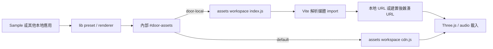

# 資產載入系統設計

> 實作狀態：CDN 與 base 入口已移至 assets 套件。lib 的 JavaScript 與型別宣告在發布建置時內嵌所需內容，不留下 assets 模組引用。

## 目標

lib 在本地開發時直接匯入 `retro-horror-door-assets` workspace 的媒體模組。sample 不複製資產、不傳圖片路徑，也不決定各 preset 使用的檔案。發布的 lib 只包含固定版本 CDN 網址，不使使用者安裝整包媒體。

## 模組責任

| 模組 | 責任 |
| --- | --- |
| `packages/door-assets` | 正式媒體、資產匯出名稱、相對路徑與 CDN 版本的唯一管理處；提供本地與 CDN 兩個入口 |
| `door-lib/src/assets/*/index.ts` | 由內部 `#door-assets` 入口取得各類資產 |
| `door-assets/index.js` | 匯出本地媒體 import，供開發 bundler 解析；`index.d.ts` 宣告資產 URL 型別 |
| `door-assets/cdn.js` | 匯出與本地入口同名的固定版本 CDN URL；不匯入媒體檔案 |
| `door-assets/base.js` | 提供固定版本 CDN base URL，供 CDN 入口組合路徑及 lib 的自行託管重寫使用；版本需與 assets manifest 一致 |
| `door-lib/src/core/presets.ts` | 定義每個完整 preset 所使用的貼圖與模型 |
| `door-lib/src/vanilla.ts` | 載入貼圖、模型及音效，控制播放與生命週期 |
| sample | 呼叫 lib 展示 preset；Vite 僅選擇本地模組解析條件 |

## 條件式入口

目前設定如下。assets 的 `package.json` 公開三個入口：

```json
"exports": {
  ".": { "types": "./index.d.ts", "default": "./index.js" },
  "./cdn": { "types": "./index.d.ts", "default": "./cdn.js" },
  "./base": { "types": "./base.d.ts", "default": "./base.js" }
}
```

本地與 CDN 入口共用資產宣告，以維持匯出名稱一致。CDN base 的 metadata 由獨立入口提供，避免 lib 為了取得版本資訊而匯入本地媒體。

lib 的 `package.json`：

```json
"imports": {
  "#door-assets": {
    "door-local": "retro-horror-door-assets",
    "default": "retro-horror-door-assets/cdn"
  }
}
```

`retro-horror-door-assets` 僅列於 lib 的 `devDependencies`。本地 workspace 安裝會建立套件連結，lib 可直接解析資產模組。一般使用者安裝 lib 不會安裝它。

使用自訂 `door-local` 條件，避免 Vite 自動切換 development/production 時改變資產選擇。sample 的開發與本地正式建置都啟用此條件；CDN 模式不啟用。tsup 發布建置不啟用此條件，因此選擇 assets 的 CDN 入口。tsup 必須明確將 `retro-horror-door-assets` 及其子路徑納入 bundle（目前以 `noExternal` 與 `dts.resolve` 設定 JavaScript 及型別內嵌），避免把這些 import 留給使用者執行時解析。lib 的 `assetUrls.ts` 從 assets 的 base 入口取得前綴，只負責網址重寫，不再保存資產版本或檔名。

## 資料流



### 本地開發

`npm install` 連結 workspaces 後，`npm run dev` 啟動 sample。lib 透過 assets 模組 import 媒體，Vite 將 import 解析成可存取的本地網址。圖片原始檔在 `packages/door-assets/textures/`，模型與音效分別在 `models/` 和 `sounds/`。修改媒體後重新整理預覽；新增資產需同步更新本地與 CDN 模組匯出及 preset。

瀏覽器仍透過應用的開發伺服器取得檔案，但沒有 sample 專屬的資產目錄或複製步驟。移除 sample 不會移除 lib 或 assets；其他本地應用需將 `retro-horror-door` alias 指向 workspace 的 `packages/door-lib/src/index.ts`，使用支援媒體 import 的 bundler，並啟用 `door-local` 條件。單獨啟用條件不會改變已編譯 dist 中的 CDN 網址。不需要獨立資產伺服器。

### 本地 sample 建置

Vite 將 assets workspace 的媒體輸出到建置產物，自動處理雜湊檔名與部署 base。這是應用 bundler 的標準資產輸出，不會將媒體重新放入 lib 的 npm 包。

### npm / beta

tsup 解析 assets 的 CDN 與 base 入口，將網址常數內嵌到 lib 產物。產物不可留下 `retro-horror-door-assets` 模組依賴或任何媒體 import。資產包先發布，再驗證 jsDelivr，最後發布 lib。beta sample 隔離安裝 registry lib，使用已編譯入口與 CDN，不引用本地 workspace lib。

## 公開 API

```ts
mountDoorEntrance({ target, preset: "biohazard-1996-a01-iron-door" });
```

預設使用方不管理資產。發布版的 `assetBaseUrl` 仍供自行託管使用，只重寫 lib 所有的 CDN URL；明確提供的 `textureUrl`、`handleModelUrl`、`soundUrl` 優先。`door-local` 模式的網址由 bundler 管理，不用 CDN 前綴重寫。

## 發布與維護

- assets 的 `files` 清單發布 `index.js`、`index.d.ts`、`cdn.js`、`base.js`、`base.d.ts`、`textures/`、`models/`、`sounds/`；Markdown 授權資訊與媒體一起保留。
- `build.mjs` 驗證本地/CDN 名稱與路徑一致、檔案存在、CDN base 版本與 manifest 一致，不生成或複製媒體。正式媒體目錄需納入版本控制；參考影片、分鏡與未使用原稿不放入 assets 發布目錄。
- assets 管理的 CDN 預設版本需與自己的 manifest 一致；lib 不重複維護版本；每次變更已發布媒體都使用新版本，不能覆寫已發布版本。
- 測試需確認本地/CDN 入口匯出相同資產名稱、路徑指向相同檔案、CDN 版本與 manifest 一致。lib 套件邊界測試檢查沒有媒體、正式 assets dependency 或未內嵌的 assets import；本地條件測試確認真實模組解析；瀏覽器測試確認本地媒體成功回應且沒有 CDN 請求。

## 限制

本地媒體 import 需要支援相關副檔名的 bundler，GLB 需設定 assetsInclude。Node 測試使用測試專用 loader 將媒體 import 轉為檔案 URL；它不是瀏覽器的執行機制。CDN 模式需要網路及已發布資產。既有載入錯誤與模型 fallback 行為保持不變。

## 已完成遷移

1. 將 lib 的 CDN 資產清單移至 assets 的 `cdn.js`，將 CDN base 與版本移至 `base.js`。
2. 在 assets 宣告 CDN/base 子路徑、型別與發布檔案。
3. 更新 lib 條件式入口、base 匯入與 tsup 內嵌設定，刪除原 CDN 清單。
4. 更新模組一致性與套件邊界測試，再驗證本地 sample 與發布產物。

此遷移不改變 `mountDoorEntrance` 公開呼叫方式、本地媒體 import 或 sample 的使用方式。
