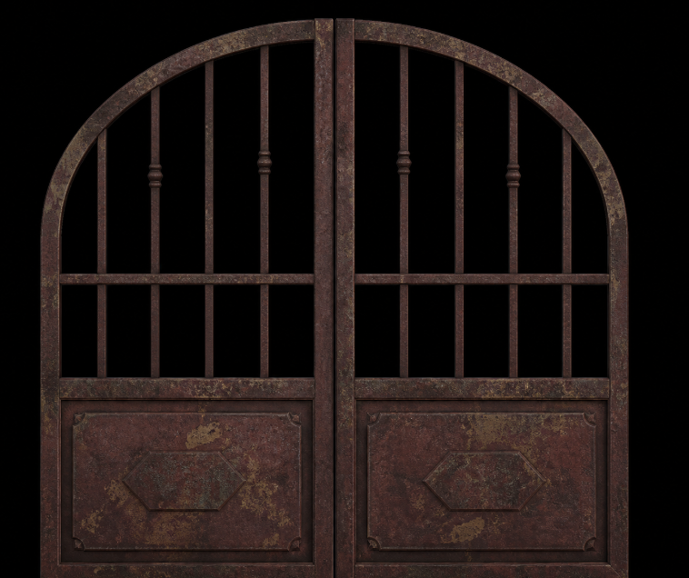

# B05 Generated Front-Face Hybrid Material Design

## Goal

Use the user-approved generated B05 static mockup as the front-face artwork for the moving gate leaves while retaining independently authored 3D geometry and procedural side/back materials. The approved generated image is an authorized project asset; original game frames, gallery stills, and external image requests remain prohibited.

## Approved Asset

- Handoff source for this implementation: `/var/folders/9x/npxlj9ls0xv1vvm510pcsblc0000gn/T/TemporaryItems/NSIRD_screencaptureui_oJcZHR/Screenshot 2026-07-15 at 10.19.40 AM.png` (the filename contains the system's narrow no-break space before `AM`). After verified copying, the repository destination below becomes the durable authoritative source.
- SHA-256: `f00e7e6f0844077dc2a930027db3d8dd40b34341d56320b197cd1855ad4cb77b`.
- Repository destination: `packages/sample/public/textures/b05/generated-gate-front.png`.
- Before copying, verify the source is an RGBA PNG with exact dimensions `758 x 636` and the exact SHA-256 above. Reject any mismatch instead of silently accepting a different screenshot.
- Treat near-black background pixels as transparent at runtime. Do not manually paint, trace, or incorporate pixels from the original game reference.
- Preserve this single source image in the repository so the POC does not depend on a temporary file, local gallery checkout, network request, or Codex conversation state.

### Visual Baseline

This embedded image is the authoritative closed-gate visual baseline. Future work must compare the actual B05 render against this exact repository asset, not against memory, a temporary screenshot, or the original game image.

## Visual Direction

- Use the approved generated static mockup directly on the front faces of the two moving leaves.
- Use a dark wine-red and brown iron base.
- Add broad, irregular, low-saturation ochre oxidation islands.
- Add sparse muted gray-green patina, charcoal pits, and restrained worn scratches.
- Avoid bright orange outlines, uniform pixel noise, obvious tiling, and polished clean metal.
- Apply one consistent material family to the arch, bars, divider, lower panel, and relief blocks.

## Procedural Maps

- Add `createAgedIronMaterialPixels(width, height, seed)` returning paired `colorPixels` and `roughnessPixels` buffers.
- Preserve `createAgedIronPixels(width, height, seed)` as a compatibility wrapper returning the paired generator's color buffer.
- In one pixel loop, calculate a shared corrosion-feature record containing coarse oxidation, patina, grain, pit, and scratch values, then derive both output pixels from that same record. Do not implement two independent noise pipelines that merely share a seed.
- Encode roughness as opaque grayscale RGBA pixels so it can be converted to a `CanvasTexture`; rust and pits are matte, while worn scratches are slightly smoother.
- Keep the color and roughness generators free of browser, Three.js, file, gallery, and network dependencies.
- Use one validator for the paired API and compatibility wrapper. Width and height must be positive safe integers, total pixels must be between `2` and `16_777_216` inclusive, and seed must be a safe integer. Reject every invalid case with `RangeError` before allocating either buffer.

## Gate-Leaf Structure

- Build each moving leaf with its own outer stile, full-height center stile, arched perimeter, four internal vertical bars, lower and middle horizontal rails, and one three-piece bar collar.
- Extend the internal bars below the middle rail so the open grille has upper and lower sections above the solid panel.
- Use a taller solid lower panel with a four-piece inset rectangular trim and a six-piece horizontally elongated hexagonal trim.
- Keep every stile, rail, trim member, collar, and plaque edge inside the moving leaf group so the complete structure opens inward; none of these members may become a stationary surrounding frame.
- Frame the closed gate closer to camera and aim at its vertical center so its proportions can be compared directly with the approved mockup.
- Keep the authoritative procedural geometry constants at leaf width `2.7`, total height `5.35`, panel height `1.55`, arch center `(2.7, 2.65)`, arch radius `2.7`, member depth `0.16`, and outer hinges at world `x = -2.7` and `x = 2.7`.
- Each front plane uses local size `2.7 x 5.35`, local center `(1.35, 2.675, 0.22)`, and remains inside the same mirrored leaf group as its procedural geometry. The `0.22` z-offset places it ahead of the deepest front trim without affecting hinge transforms.

## Hybrid Three.js Integration

- Create one color `CanvasTexture`, one roughness `CanvasTexture`, and one `MeshStandardMaterial` per mounted gate instance. Share those exact objects across every member of both leaves and dispose each object exactly once from the gate owner's unmount cleanup.
- The installed Three.js `0.133.1` API uses `colorTexture.encoding = THREE.sRGBEncoding`; set `roughnessTexture.encoding = THREE.LinearEncoding` so roughness data receives no sRGB conversion.
- Give both maps identical repeat wrapping and nearest filtering so their features remain aligned.
- Project both procedural maps in a shared `1.1` world-unit texture space so weathering stays consistent across members without stretching narrow bars.
- Configure the shared material with white `0xffffff` tint, identical metalness/roughness parameters, and the same map objects across arch, bars, divider, panel, and relief blocks so the color map is not differently multiplied per member.
- Keep the inward-opening timing, black environment, forward camera travel, fade, and controls unchanged. Calibrate the closed camera framing and B05 key, front-fill, rim, and point lights toward the approved mockup without turning the iron orange.
- Load the approved front image once per mounted gate instance and draw it unchanged to a `758 x 636` offscreen canvas. For each RGBA pixel, set alpha to `0` only when `max(red, green, blue) <= 8`; otherwise preserve all four source bytes. This removes the pure/near-black backdrop while retaining dark gate pixels.
- The detected gate bounds are source `x = 44..691`, `y = 20..635`. Split at source `x = 368`, not at the canvas midpoint `x = 379`: left crop is `[44, 20, 324, 616]` and right crop is `[368, 20, 324, 616]`. Map each crop to the full `2.7 x 5.35` plane; this deliberate 4.1% aspect adjustment aligns the approved artwork with the existing physical gate bounds and center seam.
- Copy each crop into its own `324 x 616` canvas so linear filtering cannot bleed across atlas boundaries. Draw the left crop normally. Draw the right crop horizontally reversed (`translate(324, 0)`, then `scale(-1, 1)`) before texture creation; the existing right-leaf group mirrors it once more in world space, restoring the source image's correct center-to-outer orientation. Both planes use full-range UVs from `(0, 0)` at bottom-left to `(1, 1)` at top-right.
- Create separate left- and right-leaf `CanvasTexture` objects from those crop canvases. Use `flipY = true`, `ClampToEdgeWrapping`, `LinearFilter` for minification and magnification, `generateMipmaps = false`, and `THREE.sRGBEncoding`.
- Render each front plane with `THREE.MeshBasicMaterial`: white tint, `transparent = true`, `alphaTest = 0.03`, `depthTest = true`, `depthWrite = true`, `side = THREE.FrontSide`, and `toneMapped = false`. Keep procedural geometry visible from oblique, side, and rear angles to preserve physical depth while opening.
- Dispose the source texture, derived canvas textures, and front-face materials exactly once during unmount. If image loading fails, keep the procedural gate visible as a functional fallback.
- Image loading uses a cancelled flag owned by the gate effect. Wrap image validation, canvas allocation, drawing, pixel processing, crop creation, texture creation, and material creation in one guarded `try/catch`. On success, publish resources only while mounted; otherwise dispose them immediately. On load error or processing exception, dispose every partially created resource and publish no front resources. Cleanup marks the request cancelled and disposes only resources owned by that effect, making success, failure, exception, and unmount-before-load paths idempotent.

## Gate-Only Scene

- Also apply [`2026-07-15-b05-gate-only-design.md`](./2026-07-15-b05-gate-only-design.md). If it conflicts with this document, this newer hybrid front-face document controls material and image-plane behavior while the gate-only document controls surrounding scene geometry.
- Remove visible side posts and the bottom threshold while preserving invisible hinge transforms and the leaves' own arched perimeters.

## Verification

- Pure tests prove both maps are deterministic, fully opaque, correctly sized, visibly varied, and responsive to seed changes.
- An alignment test identifies generated pit and worn-scratch color classes and verifies their paired roughness values follow the same semantic feature record: pits are matte and scratches are measurably smoother.
- Boundary tests cover minimum and maximum accepted pixel counts plus invalid non-integer, unsafe, zero, negative, one-pixel, oversized, and invalid-seed inputs, confirming both buffers are rejected before allocation.
- Roughness values include a meaningful matte-to-worn range without producing fully glossy metal.
- At progress `0`, only the paired gate leaves are visible renderable geometry and the gate shows the approved dark red-brown, ochre, and muted green aging.
- At progress `0.5`, both leaves still open inward and the generated fronts remain attached while procedural side depth is visible.
- A source/static-asset check confirms the approved generated image is the only B05 bitmap dependency and that no game frame, gallery asset, encoded duplicate, side post, bottom threshold, floor, wall, or external request appears in the implementation.
- An automated asset test reads the committed PNG directly, verifies PNG signature, IHDR dimensions `758 x 636`, RGBA color type `6`, and exact SHA-256 `f00e7e6f0844077dc2a930027db3d8dd40b34341d56320b197cd1855ad4cb77b`.
- Pure image-processing tests verify `max(R,G,B) <= 8` produces alpha `0`, every other pixel preserves all four bytes, the two crop rectangles are exact, and the right crop is reversed exactly once before the mirrored leaf transform.
- Export immutable front texture/material configuration and verify its filters, wrapping, encoding, alpha test, depth behavior, side, and tone-mapping values without requiring WebGL.
- Resource-lifecycle tests verify exactly-once disposal for normal success, load failure, processing exception, and unmount-before-load while the procedural fallback remains renderable.
- Simulate a front-image load failure and verify the procedural gate remains usable without an uncaught error.
- Mandatory visual completion gate: capture the actual gate-only render at progress `0` and place it side by side with the embedded baseline above. Confirm the image planes meet at world `x = 0` within `0.01` world units, no black rectangles appear outside the silhouette, and the outer arch, center seam, two horizontal rails, four bars per leaf, collar placement, lower inset panels, hexagonal ornaments, rust distribution, and absence of surrounding geometry match the baseline. Then capture progress `0.3` and confirm both fronts rotate with their complete leaves, procedural side thickness is visible, and no plane or trim remains at the closed position. A passing test suite without both visual captures is insufficient.
- Keep temporary comparison captures under `/private/tmp/b05-visual-comparison/`; do not commit duplicate baseline or render images.
- B05 tests, lint, production build, and `git diff --check` pass with no new errors.
